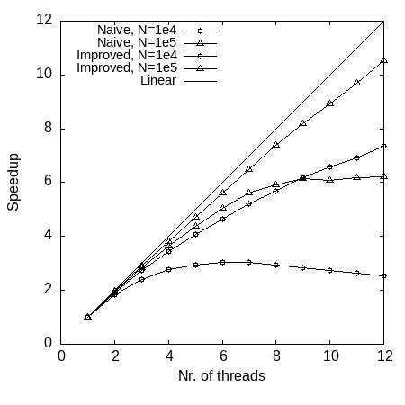

# Parallel non-uniform FFT

This is a parallel implementation of the non-uniform fast Fourier transform (NUFFT) by Greengard & Lee (2004) using OpenMP.

The main focus of this project has been to accelerate the gridding/spreading step in the NUFFT using shared memory parallelization, drawing inspiration from the Flatiron Institute NUFFT (FINUFFT) [code](https://github.com/flatironinstitute/finufft/tree/master). Additionally, basic performance testing of both the serial version and the fast Gaussian gridding (as presented in Greengard & Lee) has been performed as well. The results of these tests are presented in a report within the `doc` folder.

The purpose of this project has not been to implement something better than what is already available, but rather to offer simpler code for testing and educational purposes. For practical applications, it is recommended to consider the FINUFFT code project instead.

## Building the Code
The provided makefile should be self-explanatory. However, here are some of the basic commands:
- `make`: (or `make all`) build all executables.
- `make run_<serial or parallel>`: run tests.
- `make plots`: create plots (using gnuplot) of the data (requires the completion of the run scripts first).
