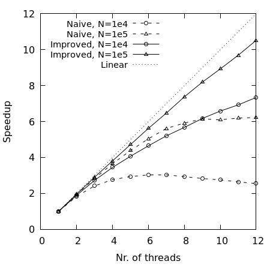

# Parallel non-uniform FFT

This is a parallel implementation of the non-uniform fast Fourier transform (NUFFT) by Greengaard & Lee (2004) using OpenMP.

The main focus of this project has been to speedup the gridding/spreading step, where I have taken inspiration from the Flatiron institute NUFFT (FINUFFT) [code](https://github.com/flatironinstitute/finufft/tree/master). Some basic performance testing of the serial version and the fast Gaussian gridding (presented in Greengaard & Lee) has been performed as well. Results of the testing is presented in a report in the `doc` folder.

The purpose of this project has not been to implement something better than what is already available, but rather provide a simpler code for testing and for educational purposes. For practical usability consider istead the FINUFFT code project. 

## Building the code
The provided makefile should be self explanatory. However, here are the basic commands:
- `make` : (or `make all`) build all executables;
- `make run_<serial or parallel>` : run tests;
- `make plots` : create plots (by gnuplot) of the data (requires the run scripts to be finished first).
